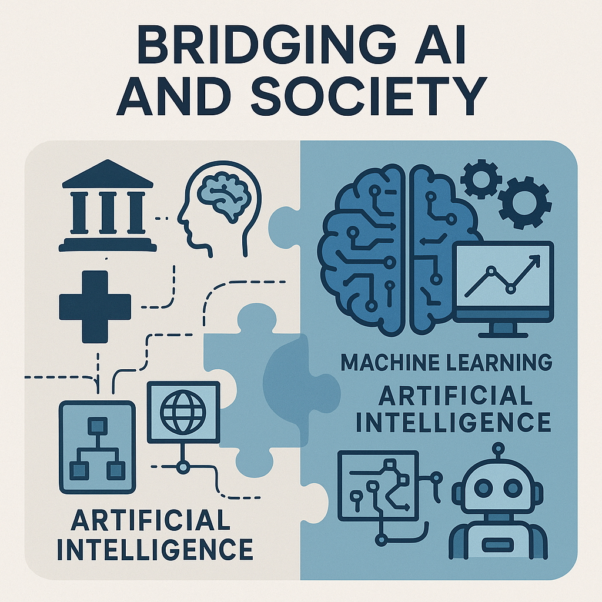

# Bridging AI & Society Summer Schools 🌞🤖

We support AI summer schools and collaborative learning, providing resources and projects for students and educators interested in Artificial Intelligence, Data Science, and Machine Learning.

  

---

## 🚀 Repository Overview

### [Course-Organisation](https://github.com/BridgingAISocietySummerSchools/Course-Organisation) 🧭📚  
**Organisational materials and participant resources for the course "Machine Learning for Interdisciplinary Audiences"**  
- Course taught at the *2025 Bridging AI and Society* summer school at Kloster Banz.
- Includes:
  - 📄 Introductory lecture on machine learning for a broad academic audience.
  - 🧠 [Technical Topics](https://github.com/BridgingAISocietySummerSchools/Course-Organisation/blob/main/technical.md): classification, regression, trees, and neural networks.
  - 🌍 [Societal Topics](https://github.com/BridgingAISocietySummerSchools/Course-Organisation/blob/main/societal.md): fake news, the EU AI Act, AI in healthcare, and the future of work.
  - 📅 Full course structure, session formats, and how to participate.
- Designed for participants from diverse disciplines — no coding or ML background required.

---

### [Data-Science-AI-Python-Course](https://github.com/BridgingAISocietySummerSchools/Data-Science-AI-Python-Course) 🐍📊  
**From "What's Python?" to analyzing real datasets in just 3 hours!**
- A beginner-friendly Python course focused on data science and AI applications.
- **No prerequisites** needed — ideal for anyone starting out.
- Learn practical skills: variables, data structures, NumPy, pandas, matplotlib, and data science workflows.
- Each notebook builds on the last, culminating in a real-world weather data analysis project.
- Includes setup scripts and instructions for virtual environments and Jupyter.
- **Perfect for:** Students, business professionals, researchers, and anyone curious about data science.
- ⭐️ Star the repo, fork it, and share your progress!  
- _[See full course structure and details in the repo.](https://github.com/BridgingAISocietySummerSchools/Data-Science-AI-Python-Course)_

---

### [Hands-On-Notebooks](https://github.com/BridgingAISocietySummerSchools/Hands-On-Notebooks) 📓🧑‍💻  
**A curated collection of Jupyter notebooks to teach the fundamentals of machine learning.**
- Beginner-friendly and designed for hands-on use in our interdisciplinary summer schools.
- Covers essential ML concepts including linear models, decision trees, random forests, and gradient boosting.
- Emphasizes visual intuition, experimentation, and interpretability.
- Notebooks are Colab-compatible — just click and run, no installation required.
- Local setup instructions for Anaconda, Docker, and virtual environments are included.
- _[Browse the notebooks and setup guide in the repo.](https://github.com/BridgingAISocietySummerSchools/Hands-On-Notebooks)_

---

<!--
### [Coding-Project](https://github.com/StudienstiftungAISummerSchools/Coding-Project) 👩‍💻👨‍💻🔒
A private repository for collaborative coding projects that encourage teamwork and innovation within the summer school community.
- **Visibility:** Private
- Used for group work, capstone projects, and advanced exercises.

---
-->

## 🤝 Get Involved

We welcome contributions and collaboration!  
For more information about our projects or to get in touch, visit our repositories or contact us via GitHub.

---

_Last updated: July 2025_
